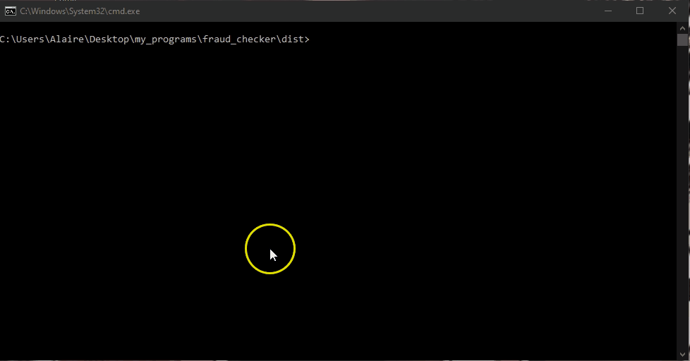

# 🎬 Demo & Pliki Testowe

W tym folderze znajdują się materiały demonstracyjne pokazujące działanie aplikacji **Fraud Checker** w interfejsie wiersza poleceń (CLI).

### 📂 Zawartość folderu:
* `fc_demo.gif` – plik GIF prezentujący uruchomienie programu i wynik komendy.
* `generated_jsons.jpg` - Plik JPG przedstawiający folder z wygenerowanymi plikami json (ścieżka: `<folder_z_programem>\output`)
* `sample_clean_woman.json` – Przykładowy wniosek z poprawnym numerem PESEL (oczekiwany wynik: `ACCEPT`).
* `sample_blacklisted_man.json` – Przykładowy wniosek z numerem PESEL znajdującym się na czarnej liście (oczekiwany wynik: `REJECT`).

### 🚀 Szybkie przetestowanie z tego folderu:

Mając pobraną aplikację (`fraud_checker.exe` lub `main.py`), możesz odpalić testy poniższymi komendami:

```powershell
# Dla wersji .exe:
fraud_checker.exe demo/sample_clean_woman.json
fraud_checker.exe demo/sample_blacklisted_man.json

# Dla skryptu Python:
python main.py demo/sample_clean_woman.json
python main.py demo/sample_blacklisted_man.json
```
W podawaniu ścieżki do sprawdzanych plików json należy zwrócić uwagę, żeby wskazać odpowiedni format. Można to zrobić poprzez:
* Przekazanie ścieżki absolutnej (przykładowo: `fraud_checker.exe C:\demo\sample_clean_woman.json`)
* Przekazanie ścieżki relatywnej (przykładowo: `.\fraud_checker.exe ..\demo\sample_blacklisted_man.json`)

### Demo aplikacji:

